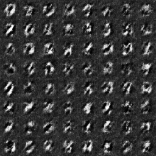
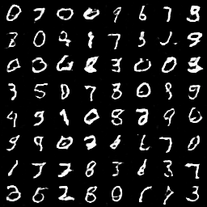
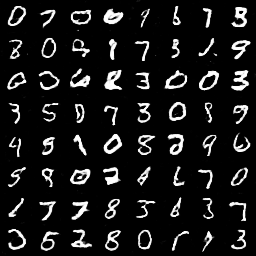
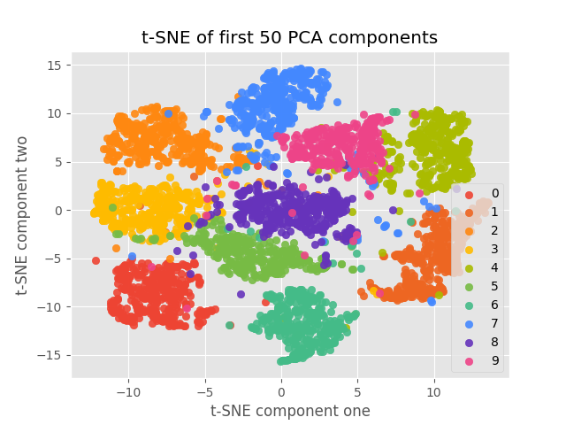
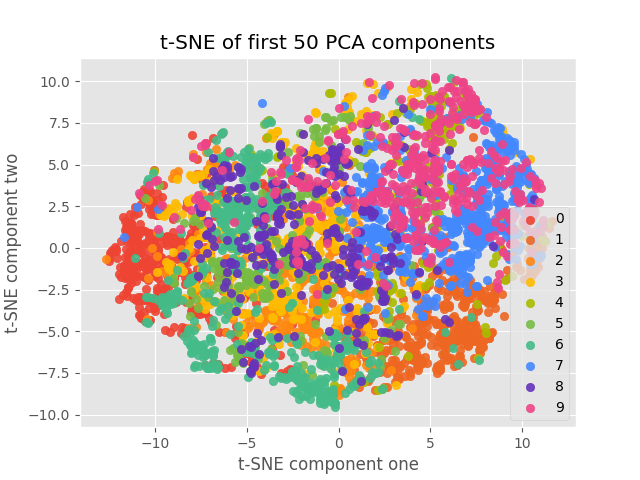

# visualizing-GAN-layers

Generative Adversarial Networks are state-of-the-art deep models that learn to produce realistic synthtic images as a byproduct of an adversarial game between two competing learning agents, called a generator and a discriminator.

In order to understand more about how GANs learn to represent class information internally, we need a way to visualize the activations of the layers inside the network. I have assembled a dimensionality reduction algorithm which combines PCA and t-SNE in order to represent the multi-dimensional activations in a humanly understandable 2-dimensional space.

The process is to first train a GAN and a classifier on the MNIST dataset, and then generate new images while recording the activations inside the GAN. We predict the labels of the generated images, and then use them to color the activations of the intermediate layers when plotting them. This allows interesting observations to be made about the appearance and propagation of class information inside of the GAN.

This repository is a section of the work completed in partial fulfilment of the requirements for the degree of BSc (Hons) in Computer Science at the University of Manchester. The dissertation details the conclusions of the research [Andrei_Iliescu_Report.pdf](Andrei_Iliescu_Report.pdf).

## Overview
* [checkpoint/](checkpoint) Pre-trained GAN and classifier models.
* [train/gan/](train/gan) Generated images over every epoch of training.
* [visualizations/](visualizations) Saved visualizations of intermediate GAN layers.
* [Andrei_Iliescu_Report.pdf](Andrei_Iliescu_Report.pdf) Dissertation introducing GANs and detailing the visualizations performed here.

## Dependencies

The model has been run with GPU-accelerated TensorFlow using the following packages:

* [Python](https://www.python.org/downloads/) 3.5
* [Keras](https://github.com/fchollet/keras) 2.2
* [Tensorflow](https://www.tensorflow.org/install/) 1.12
* [numpy](https://github.com/numpy/numpy) 1.15
* [scikit-learn](https://github.com/scikit-learn/scikit-learn) 0.2
* [matplotlib](https://github.com/matplotlib/matplotlib) 2.2

## Installation and running

1. Make sure all dependencies are installed.
2. Clone the repository.

3. First, train the GAN model (skip this step if you want to use the pre-trained model).
```bash
python3 train_gan.py
```

4. Then, train the classifier model (skip this step if you want to use the pre-trained model).
```bash
python3 train_classifier.py
```

5. Finally, produce visualizations of the internal GAN layers.
```bash
python3 visualize_gan.py
```

## Generated images

GAN-generated MNIST over 1, 20 and 40 epochs.





## Visualizations

Visualization of the 3rd discriminator layer on real images.



Visualization of the 3rd generator layer.



Visualization of the 3rd discriminator layer on generated images.


## License

Everything is licensed under the MIT license.
